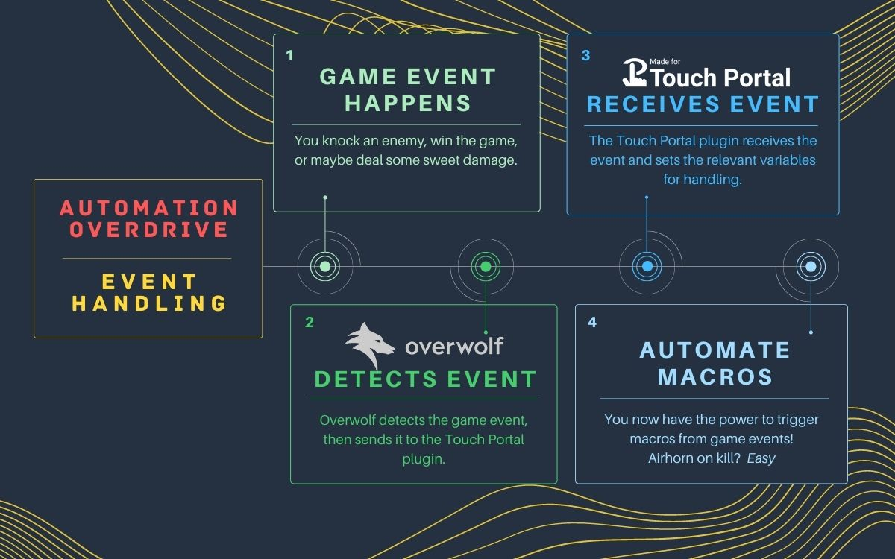

# Automation Overdrive - Overwolf Events made for Touch Portal
<!-- 
 -->

Automation Overdrive is an [Overwolf](https://www.overwolf.com/) app that lets you supercharge your Touch Portal macros with triggered events live from your games! Here's how it works:

# Setup

## Setting up Touch Portal (App and Plugin)

1. Touch Portal general guides can be found on the [official site](https://www.touch-portal.com/blog/post/tutorials/get_started_with_touch_portal.php)
2. NOTE: In order to use the *Automation Overdrive* custom plugin, you will need to have purchased the "pro" version of Touch Portal. 
3. Download the *Automation Overdrive* plugin [here](replaceme.com)
4. Install the plugin following the short steps outlined on the [official site](https://www.touch-portal.com/blog/post/tutorials/import-plugin-guide.php)

-----

## Setting up Touch Portal Events

There are two primary methods of setting up "handlers" for events coming from Overwolf. Button-based events, and global events.

### Button-based events
To set up a button-based event:
1. Create a new button
2. Click the "On `Event`" tab
3. Add the "`Event`" block "`When Plug-in State changes`"
4. Fill out the dropdowns
   1. Set the first dropdown to "`Overwolf Event`"
   2. Set the second dropdown to "`changes to`"
   3. Fill in the last text box with the event that you want to handle - i.e. "`assist`"

Button examples can be downloaded from the [examples](./examples) folder and imported directly into Touch Portal. The Apex example button is shown here:

### Global events
Global events can be triggered regardless of which page your device is currently on, making them particularly useful if you use multiple pages within Touch Portal.
1. Select "`Events`" from the main-menu (located on the left side of the UI)
2. Click "`Add Event...`" at the top
3. Give your event a name
4. In the "`Event`" dropdown, select "`Plug-in (17) - When Plug-in State changes`"
5. Fill out the dropdowns
   1. Set the first dropdown to "`Overwolf Event`"
   2. Set the second dropdown to "`changes to`"
   3. Fill in the last text box with the event that you want to handle - i.e. "`kill`"
6. Add actions to your flow that will fire when the event is triggered.

Global events are not able to be imported or exported, but look like this after following the steps above:

## Testing the events

To test the Automation Overdrive events:
1. Launch one of the supported games and toggle the visibility of the app (the default key combination is "`ctrl+shift+[`" ).
2. If the status light is green, you've connected successfully!
3. Click one of the teal test buttons to send a test event
4. If everything is set up, the button text on your device should have updated to match the button that you clicked, shown below:
   
 

# Supported Events (more soon™)

## Apex Legends
- `assist`
- `damage`
- `death`
- `win`
- `headshot`
- `healed_from_ko`
- `kill`
- `knockdown`
- `knocked_out`
- `match_start`
- `match_end`
- `melee`
- `respawn`

## Rocket League
- `death`
- `defeat`
- `goal`
- `matchStart`
- `matchEnd`
- `opposingTeamGoal`
- `teamGoal`
- `victory`

# Support
Found a bug or having an issue after following the instructions? Please open a new issue [here](https://github.com/raimen-ttv/TouchPortal-Overdrive/issues) so that we can address it as soon as possible.

Have an idea that you would like to see added? Open an issue in the link above, or reach out directly while I'm live on [Twitch](https://twitch.tv/raimen)!

# Terms and Conditions

YOU EXPRESSLY ACKNOWLEDGE THAT YOUR USE OF THE SERVICES IS AT YOUR SOLE RISK AND THAT THE SERVICES ARE PROVIDED "AS IS" AND "AS AVAILABLE." AUTOMATION OVERDRIVE AND ANYONE AFFILIATED SHALL NOT BE RESPONSIBLE FOR ANY DAMAGE TO YOUR COMPUTER SYSTEM OR LOSS OF DATA RESULTING FROM YOUR USE OF THE SERVICES, APP, OR PLUGIN.

Automation Overdrive's Overwolf app relies on Overwolf's event API to function as intended. As such, Overwolf events are sometimes unavailable (usually occurring after a game makes a major update), and some or all functionality will be unusable. This is unavoidable, and unable to be fixed through changes to Automation Overdrive. 
