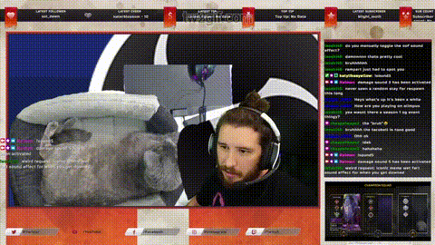

# Automation Overdrive - Overwolf Events made for Touch Portal
<!-- 
 -->

Automation Overdrive is an [Overwolf](https://www.overwolf.com/) app that allows you to supercharge Touch Portal macros with triggered events live from your games! Here's how it works:

# Setup

## Setting up Touch Portal (App and Plugin)
NOTE: In order to use the *Automation Overdrive* custom plugin, you will need to have purchased the "pro" version of Touch Portal. 
1. Download and install *Automation Overdrive* from the official Overwolf store [here](https://www.overwolf.com/app/Raimen_TTV-Automation_Overdrive)
2. Touch Portal general guides can be found on the [official site](https://www.touch-portal.com/blog/post/tutorials/get_started_with_touch_portal.php)
3. Download the *Automation Overdrive* Touch Portal plugin [here](./plugin/AutomationOverdrive-Win.tpp)
4. Install the plugin following these [short steps](https://www.touch-portal.com/blog/post/tutorials/import-plugin-guide.php)

-----

## Setting up Touch Portal Events

There are two primary methods for handling events coming from Overwolf: button-based events and global events.

### Button-based Events
To set up a button-based event:
1. Create a new button
2. Click the "On `Event`" tab
3. Add the "`Event`" block "`When Plug-in State changes`"
4. Fill out the dropdowns
   1. Set the first dropdown to "`Overwolf Event`"
   2. Set the second dropdown to "`changes to`"
   3. Fill in the last text box with the event that you want to handle (i.e. "`assist`")

Button examples can be downloaded from the [examples](./examples) folder and imported directly into Touch Portal. The Apex example button is shown here:

### Global Events
Global events can be triggered regardless of which page your device is currently on, making them particularly useful if you use multiple pages within Touch Portal.
1. Select "`Events`" from the main menu (located on the left side of the UI)
2. Click "`Add Event...`" at the top
3. Name your event
4. In the "`Event`" dropdown, select "`Plug-in (17) - When Plug-in State changes`"
5. Fill out the dropdowns
   1. Set the first dropdown to "`Overwolf Event`"
   2. Set the second dropdown to "`changes to`"
   3. Fill in the last text box with the event that you want to handle (i.e. "`kill`")
6. Add actions to your flow that will fire when the event is triggered.

Unfortunately, global events cannot currently be imported nor exported. Example from above:

## Testing Events

To test the *Automation Overdrive* events:
1. Import an [example button](./examples) to Touch Portal
2. Make sure your mobile device is connected and the button is visible on your current page
3. Launch a supported game and toggle the app visibility (the default key combination is "`ctrl+shift+[`" ).
4. If the status light is green, you've connected successfully! If it is not, follow the troubleshooting steps below
5. Click one of the teal test buttons to send a test event
6. The button text on your device should update to match the button that you clicked, shown below:
   
 

# Supported Events (more soon™)

## Apex Legends
- `assist`
- `damage`
- `death`
- `headshot`
- `healed_from_ko`
- `kill`
- `knockdown`
- `knocked_out`
- `match_start`
- `match_end`
- `melee`
- `respawn`
- `win`

## Rocket League
- `death`
- `defeat`
- `goal`
- `match_start`
- `match_end`
- `opposingTeamGoal`
- `teamGoal`
- `win`

## Examples
### Apex Legends 
Scene Change @ match start:

Twitch Clip: [Taco Bell Dong Apex Headshot](https://www.twitch.tv/raimen/clip/BashfulInnocentAardvarkDancingBaby-XQVst5CpxMVP77ER)

### Rocket League
Gif overlay, airhorn, and emoji spam on goal:

---

# Support and Feedback
Found a bug or having issues? Please open a new issue [here](https://github.com/raimen-ttv/TouchPortal-Overdrive/issues) so that we can address it as soon as possible.

Have an idea that you would like to see added? Open an issue in the link above, or reach out directly while I'm live on [Twitch](https://twitch.tv/raimen)!

If you have a particularly cool event that you have made with this tool that you would like me to post here, please private message me on [Twitch](https://twitch.tv/raimen) or [Twitter](https://twitter.com/raimen)!

## FAQ
<!-- ### I clicked on the app but nothing happened!
This app is meant to run in the background, and chances are that it is! Make sure that your focused window is a supported game, then press the show-hide toggle key. The default hotkey is "`Ctrl+Shift+[`". If the app does not appear, check that you have not changed the default hotkey. -->

### I see the events in the app but TouchPortal isn’t receiving anything.
If the status button in the app’s debug window is not "`Connected to TP`", try clicking the "`Retry Connection`" button. Make sure that you have a simple button or event configured in and try again. If you continue to have trouble, follow the guide or import a button from the [Setup](https://github.com/raimen-ttv/Automation-Overdrive#setup) section. 

--- 

# Proud *`Automation Overdrive`* Users
The following streamers trust *`Automation Overdrive`* to handle their stream automation, and have liked it enough to have their name listed here. If you love the app and want to have your name added here, reach out to me on [Twitter](https://twitter.com/raimen) via DM or mention. 

- [Raimen](https://twitch.tv/raimen)

---

# Terms and Conditions

YOU EXPRESSLY ACKNOWLEDGE THAT YOUR USE OF THE SERVICES IS AT YOUR SOLE RISK AND THAT THE SERVICES ARE PROVIDED "AS IS" AND "AS AVAILABLE." AUTOMATION OVERDRIVE AND ANYONE AFFILIATED SHALL NOT BE RESPONSIBLE FOR ANY DAMAGE TO YOUR COMPUTER SYSTEM OR LOSS OF DATA RESULTING FROM YOUR USE OF THE SERVICES, APP, OR PLUGIN.

Automation Overdrive's Overwolf app relies on Overwolf's event API to function as intended. As such, Overwolf events are sometimes unavailable (usually occurring after a game makes a major update), and some or all functionality will be unusable. This is unavoidable, and unable to be fixed through changes to Automation Overdrive. 
